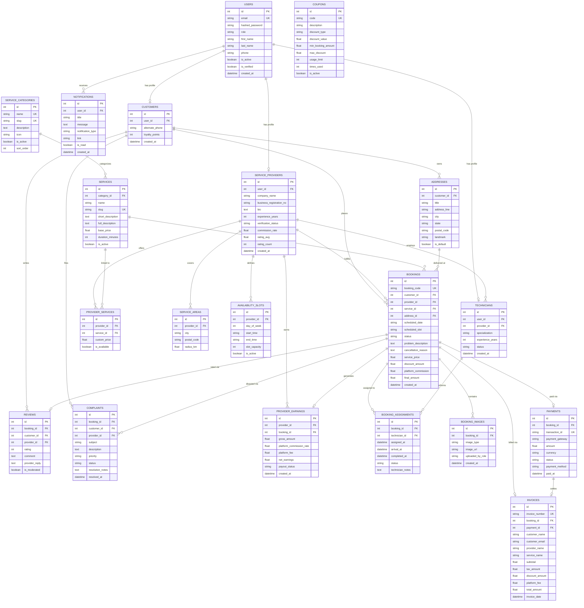

# Entity Relationship Diagram (ERD)
## HomeServe Technologies SaaS Platform

```mermaid
erDiagram
    USERS ||--o| CUSTOMERS : "has profile"
    USERS ||--o| SERVICE_PROVIDERS : "has profile"
    USERS ||--o| TECHNICIANS : "has profile"
    USERS ||--o{ NOTIFICATIONS : "receives"

    CUSTOMERS ||--o{ ADDRESSES : "owns"
    CUSTOMERS ||--o{ BOOKINGS : "places"
    CUSTOMERS ||--o{ REVIEWS : "writes"
    CUSTOMERS ||--o{ COMPLAINTS : "files"

    SERVICE_PROVIDERS ||--o{ TECHNICIANS : "employs"
    SERVICE_PROVIDERS ||--o{ PROVIDER_SERVICES : "offers"
    SERVICE_PROVIDERS ||--o{ SERVICE_AREAS : "covers"
    SERVICE_PROVIDERS ||--o{ AVAILABILITY_SLOTS : "defines"
    SERVICE_PROVIDERS ||--o{ BOOKINGS : "fulfills"
    SERVICE_PROVIDERS ||--o{ PROVIDER_EARNINGS : "earns"

    SERVICE_CATEGORIES ||--o{ SERVICES : "categorizes"
    SERVICES ||--o{ PROVIDER_SERVICES : "linked to"
    SERVICES ||--o{ BOOKINGS : "booked in"

    BOOKINGS ||--o{ BOOKING_ASSIGNMENTS : "assigned to"
    BOOKINGS ||--o{ BOOKING_IMAGES : "contains"
    BOOKINGS ||--o| PAYMENTS : "paid via"
    BOOKINGS ||--o| INVOICES : "billed via"
    BOOKINGS ||--o| REVIEWS : "rated via"
    BOOKINGS ||--o{ COMPLAINTS : "disputed via"
    BOOKINGS ||--o| PROVIDER_EARNINGS : "generates"

    TECHNICIANS ||--o{ BOOKING_ASSIGNMENTS : "performs"
    PAYMENTS ||--o| INVOICES : "settles"
    ADDRESSES ||--o{ BOOKINGS : "delivered at"

    USERS {
        int id PK
        string email UK
        string hashed_password
        string role
        string first_name
        string last_name
        string phone
        boolean is_active
        boolean is_verified
        datetime created_at
    }

    CUSTOMERS {
        int id PK
        int user_id FK
        string alternate_phone
        int loyalty_points
        datetime created_at
    }

    SERVICE_PROVIDERS {
        int id PK
        int user_id FK
        string company_name
        string business_registration_no
        text bio
        int experience_years
        string verification_status
        float commission_rate
        float rating_avg
        int rating_count
        datetime created_at
    }

    TECHNICIANS {
        int id PK
        int user_id FK
        int provider_id FK
        string specialization
        int experience_years
        string status
        datetime created_at
    }

    ADDRESSES {
        int id PK
        int customer_id FK
        string title
        string address_line
        string city
        string state
        string postal_code
        string landmark
        boolean is_default
    }

    SERVICE_CATEGORIES {
        int id PK
        string name UK
        string slug UK
        text description
        string icon
        boolean is_active
        int sort_order
    }

    SERVICES {
        int id PK
        int category_id FK
        string name
        string slug UK
        text short_description
        text full_description
        float base_price
        int duration_minutes
        boolean is_active
    }

    PROVIDER_SERVICES {
        int id PK
        int provider_id FK
        int service_id FK
        float custom_price
        boolean is_available
    }

    SERVICE_AREAS {
        int id PK
        int provider_id FK
        string city
        string postal_code
        float radius_km
    }

    AVAILABILITY_SLOTS {
        int id PK
        int provider_id FK
        int day_of_week
        string start_time
        string end_time
        int slot_capacity
        boolean is_active
    }

    BOOKINGS {
        int id PK
        string booking_code UK
        int customer_id FK
        int provider_id FK
        int service_id FK
        int address_id FK
        string scheduled_date
        string scheduled_slot
        string status
        text problem_description
        text cancellation_reason
        float service_price
        float discount_amount
        float platform_commission
        float final_amount
        datetime created_at
    }

    BOOKING_ASSIGNMENTS {
        int id PK
        int booking_id FK
        int technician_id FK
        datetime assigned_at
        datetime arrival_at
        datetime completed_at
        string status
        text technician_notes
    }

    BOOKING_IMAGES {
        int id PK
        int booking_id FK
        string image_type
        string image_url
        string uploaded_by_role
        datetime created_at
    }

    PAYMENTS {
        int id PK
        int booking_id FK
        string transaction_id UK
        string payment_gateway
        float amount
        string currency
        string status
        string payment_method
        datetime paid_at
    }

    INVOICES {
        int id PK
        string invoice_number UK
        int booking_id FK
        int payment_id FK
        string customer_name
        string customer_email
        string provider_name
        string service_name
        float subtotal
        float tax_amount
        float discount_amount
        float platform_fee
        float total_amount
        datetime invoice_date
    }

    COUPONS {
        int id PK
        string code UK
        string description
        string discount_type
        float discount_value
        float min_booking_amount
        float max_discount
        int usage_limit
        int times_used
        boolean is_active
    }

    REVIEWS {
        int id PK
        int booking_id FK
        int customer_id FK
        int provider_id FK
        int rating
        text comment
        text provider_reply
        boolean is_moderated
    }

    COMPLAINTS {
        int id PK
        int booking_id FK
        int customer_id FK
        int provider_id FK
        string subject
        text description
        string priority
        string status
        text resolution_notes
        datetime resolved_at
    }

    NOTIFICATIONS {
        int id PK
        int user_id FK
        string title
        text message
        string notification_type
        string link
        boolean is_read
        datetime created_at
    }

    PROVIDER_EARNINGS {
        int id PK
        int provider_id FK
        int booking_id FK
        float gross_amount
        float platform_commission_rate
        float platform_fee
        float net_earnings
        string payout_status
        datetime created_at
    }
```
